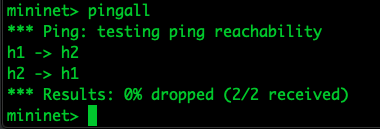

## Table of contents
{: .no_toc .text-delta }

1. TOC
{:toc}

# Prerequisites

In order to successfully install and run Distrinet, ensure your system meets the requirements described in this section.


# Configuration
Distrinet requires one master and at least one worker.
Distrinet client should be able to connect by ssh to the master and the master should be able to connect to the workers.
We are using ubuntu 18.04 for this tutorial.


1) Generate a ssh keypair (if you don't have one) in your Distrinet Client and put the public id in ~/.ssh/authorized_keys file of the master host and the worker hosts.
```
ubuntu@client:~$ ssh-keygen
Generating public/private rsa key pair.
Enter file in which to save the key (/home/ubuntu/.ssh/id_rsa):
Created directory '/home/ubuntu/.ssh'.
Enter passphrase (empty for no passphrase):
Enter same passphrase again:
Your identification has been saved in /home/ubuntu/.ssh/id_rsa.
Your public key has been saved in /home/ubuntu/.ssh/id_rsa.pub.
The key fingerprint is:
SHA256:oDZWlqHezJXU6ET1+rbXXXXXXXXXXXXXXXXXXXXX ubuntu@client
The key's randomart image is:
+---[RSA 2048]----+
|^B    ..o+.      |
|*=o  . +....     |
|*=  . =oo   .    |
|..=..B o.  .     |
|.+ +*.+ S .      |
|o..o .. + ...    |
|+E     . . +o    |
|        .  .o.   |
|            o.   |
+----[SHA256]-----+
ubuntu@client:~$
ubuntu@client:~$ cat .ssh/id_rsa.pub
ssh-rsa AAAAB3NzaC1yc2EAAAADAQABAAABAQC4auR5Gxae2aHx0Sde69c1tJiFFWNx0DlAN+pJNkmT/wGyIfntMBWAL6qVrfJOSSFbmBu8crFQbI9Ouay+TsP2Ni0gVg1e9G8r6O4BCOsTD6N/vb/v3BZ7II/RsHoZC5mdiTySPuQTAM7dTxD7YpgMxUtUI+FyZqpaEKCcfB66LZmmEhMlAYYDtZHKZcgaTfO04nw9DYEymxWKkQzoxxTAfQeGKKgobyspdboTH8PkSXjq4un/RoaeKfjAT9HdCGVFuvpO/JRzewb6ze7wTET9ntWjDKoi8lFoPO09nrQCLsJ6cxLBgIZaGw/B5eFl6XBjfpmO/kfyNxQt9zHaM+Yn ubuntu@client
ubuntu@client:~$
```

Now put the genereted key the master and the workers with (IMPORTANT tou need to allow the client tu connect by ssh to the root account of the master and the workers):
```
root@master:~$ mkdir ~/.ssh
root@master:~$ echo "ID_RSA.PUB CLIENT" >> ~/.ssh/authorized_keys
```
In my example will be:
```
root@master:~$ mkdir ~/.ssh
root@master:~$ echo "ssh-rsa AAAAB3NzaC1yc2EAAAADAQABAAABAQC4auR5Gxae2aHx0Sde69c1tJiFFWNx0DlAN+pJNkmT/wGyIfntMBWAL6qVrfJOSSFbmBu8crFQbI9Ouay+TsP2Ni0gVg1e9G8r6O4BCOsTD6N/vb/v3BZ7II/RsHoZC5mdiTySPuQTAM7dTxD7YpgMxUtUI+FyZqpaEKCcfB66LZmmEhMlAYYDtZHKZcgaTfO04nw9DYEymxWKkQzoxxTAfQeGKKgobyspdboTH8PkSXjq4un/RoaeKfjAT9HdCGVFuvpO/JRzewb6ze7wTET9ntWjDKoi8lFoPO09nrQCLsJ6cxLBgIZaGw/B5eFl6XBjfpmO/kfyNxQt9zHaM+Yn ubuntu@client" >> ~/.ssh/authorized_keys
```

```
root@worker1:~$ mkdir ~/.ssh
root@worker1:~$ echo "ssh-rsa AAAAB3NzaC1yc2EAAAADAQABAAABAQC4auR5Gxae2aHx0Sde69c1tJiFFWNx0DlAN+pJNkmT/wGyIfntMBWAL6qVrfJOSSFbmBu8crFQbI9Ouay+TsP2Ni0gVg1e9G8r6O4BCOsTD6N/vb/v3BZ7II/RsHoZC5mdiTySPuQTAM7dTxD7YpgMxUtUI+FyZqpaEKCcfB66LZmmEhMlAYYDtZHKZcgaTfO04nw9DYEymxWKkQzoxxTAfQeGKKgobyspdboTH8PkSXjq4un/RoaeKfjAT9HdCGVFuvpO/JRzewb6ze7wTET9ntWjDKoi8lFoPO09nrQCLsJ6cxLBgIZaGw/B5eFl6XBjfpmO/kfyNxQt9zHaM+Yn ubuntu@client" >> ~/.ssh/authorized_keys
```

```
root@worker2:~$ mkdir ~/.ssh
root@worker2:~$ echo "ssh-rsa AAAAB3NzaC1yc2EAAAADAQABAAABAQC4auR5Gxae2aHx0Sde69c1tJiFFWNx0DlAN+pJNkmT/wGyIfntMBWAL6qVrfJOSSFbmBu8crFQbI9Ouay+TsP2Ni0gVg1e9G8r6O4BCOsTD6N/vb/v3BZ7II/RsHoZC5mdiTySPuQTAM7dTxD7YpgMxUtUI+FyZqpaEKCcfB66LZmmEhMlAYYDtZHKZcgaTfO04nw9DYEymxWKkQzoxxTAfQeGKKgobyspdboTH8PkSXjq4un/RoaeKfjAT9HdCGVFuvpO/JRzewb6ze7wTET9ntWjDKoi8lFoPO09nrQCLsJ6cxLBgIZaGw/B5eFl6XBjfpmO/kfyNxQt9zHaM+Yn ubuntu@client" >> ~/.ssh/authorized_keys
```


To check that the configuration is ok, try to connect via ssh to the master and the hosts;

In my case: 
- master is at: 172.16.66.92
- worker1 is at: 172.16.66.93
- worker2 is at: 172.16.66.94

```
ubuntu@client:~$ ssh root@172.16.66.92 echo connected
connected
ubuntu@client:~$ ssh -J root@172.16.66.92 root@172.16.66.93 echo connected
connected
ubuntu@client:~$ ssh -J root@172.16.66.92 root@172.16.66.94 echo connected
connected
ubuntu@client:~$
```


2) Generate a ssh keypair in your Master and put the public id in ~/.ssh/authorized_keys file of master host and the worker hosts.

```
root@master:~$ ssh-keygen
Generating public/private rsa key pair.
Enter file in which to save the key (/root/.ssh/id_rsa):
Enter passphrase (empty for no passphrase):
Enter same passphrase again:
Your identification has been saved in /root/.ssh/id_rsa.
Your public key has been saved in /root/.ssh/id_rsa.pub.
The key fingerprint is:
SHA256:v9r3KiI+K85kpss8cZ1p4mJUnnXXXXXXXXXXXXXXX root@master
The key's randomart image is:
+---[RSA 2048]----+
|                 |
|    .            |
|     o   . .     |
|    . o . . o    |
|   + o =S    = . |
|  o * .  .  + + .|
| . +*+    .. + . |
| o+*o o .o+.o o  |
| .==.oo++=+*E=.  |
+----[SHA256]-----+
root@master:~$ cat .ssh/id_rsa.pub
ssh-rsa AAAAB3NzaC1yc2EAAAADAQABAAABAQC1tw/qqr3qY+wHKZJw4d5uATiOsar1UCdUxG3RHYShodscvRcnWtt5Z2MR71549n8UL7WDqpLnGqBD+IamI0E6gqS0EOhiy+tBx5JesIfllEbMrPN98qZk7p6fjD7fnU/FCucUoVhRpw417YFMUzNOqNYCntWxXGDt6grGpzzwoKlyGMo9XZKUBaL0yjjGRaIN970wEte3nhW6CGeJprN7kVxxr3qpPuhuIk2ANWJk+xYls+lCcq13qAYsnXeDz1wfAwx5uB2aJHg0ETgq8FjWhh8qHlRBzq/StlHlPVwpsR81/TV9Oba7yDQLtXPPJpcqfP+DPURoUWr9NWaAVIvh root@master
```

Now put the genereted key the master and the workers with:
```
root@master:~$ mkdir ~/.ssh
root@master:~$ echo "ID_RSA.PUB MASTER" >> ~/.ssh/authorized_keys
```

In my example will be:
```
root@master:~$ echo "ssh-rsa AAAAB3NzaC1yc2EAAAADAQABAAABAQC1tw/qqr3qY+wHKZJw4d5uATiOsar1UCdUxG3RHYShodscvRcnWtt5Z2MR71549n8UL7WDqpLnGqBD+IamI0E6gqS0EOhiy+tBx5JesIfllEbMrPN98qZk7p6fjD7fnU/FCucUoVhRpw417YFMUzNOqNYCntWxXGDt6grGpzzwoKlyGMo9XZKUBaL0yjjGRaIN970wEte3nhW6CGeJprN7kVxxr3qpPuhuIk2ANWJk+xYls+lCcq13qAYsnXeDz1wfAwx5uB2aJHg0ETgq8FjWhh8qHlRBzq/StlHlPVwpsR81/TV9Oba7yDQLtXPPJpcqfP+DPURoUWr9NWaAVIvh root@master" >> ~/.ssh/authorized_keys
```

```
root@worker1:~$ echo "ssh-rsa AAAAB3NzaC1yc2EAAAADAQABAAABAQC1tw/qqr3qY+wHKZJw4d5uATiOsar1UCdUxG3RHYShodscvRcnWtt5Z2MR71549n8UL7WDqpLnGqBD+IamI0E6gqS0EOhiy+tBx5JesIfllEbMrPN98qZk7p6fjD7fnU/FCucUoVhRpw417YFMUzNOqNYCntWxXGDt6grGpzzwoKlyGMo9XZKUBaL0yjjGRaIN970wEte3nhW6CGeJprN7kVxxr3qpPuhuIk2ANWJk+xYls+lCcq13qAYsnXeDz1wfAwx5uB2aJHg0ETgq8FjWhh8qHlRBzq/StlHlPVwpsR81/TV9Oba7yDQLtXPPJpcqfP+DPURoUWr9NWaAVIvh root@master" >> ~/.ssh/authorized_keys
```

```
root@worker2:~$ echo "ssh-rsa AAAAB3NzaC1yc2EAAAADAQABAAABAQC1tw/qqr3qY+wHKZJw4d5uATiOsar1UCdUxG3RHYShodscvRcnWtt5Z2MR71549n8UL7WDqpLnGqBD+IamI0E6gqS0EOhiy+tBx5JesIfllEbMrPN98qZk7p6fjD7fnU/FCucUoVhRpw417YFMUzNOqNYCntWxXGDt6grGpzzwoKlyGMo9XZKUBaL0yjjGRaIN970wEte3nhW6CGeJprN7kVxxr3qpPuhuIk2ANWJk+xYls+lCcq13qAYsnXeDz1wfAwx5uB2aJHg0ETgq8FjWhh8qHlRBzq/StlHlPVwpsR81/TV9Oba7yDQLtXPPJpcqfP+DPURoUWr9NWaAVIvh root@master" >> ~/.ssh/authorized_keys
```

Check that the configuration is ok

```
root@master:~$ ssh root@localhost echo connected
connected
root@master:~$ ssh root@172.16.66.93 echo connected
The authenticity of host '172.16.66.93 (172.16.66.93)' can't be established.
ECDSA key fingerprint is SHA256:hPpFPR7LE7iszMc3b0a6zzqAIljFTdTNkdBSvMcWFm4.
Are you sure you want to continue connecting (yes/no)? yes
Warning: Permanently added '172.16.66.93' (ECDSA) to the list of known hosts.
connected
root@master:~$ ssh root@172.16.66.94 echo connected
The authenticity of host '172.16.66.94 (172.16.66.94)' can't be established.
ECDSA key fingerprint is SHA256:VFxX2pT7jxeiv7y44v/Da38/Q5wRPle5FxWCajekhLI.
Are you sure you want to continue connecting (yes/no)? yes
Warning: Permanently added '172.16.66.94' (ECDSA) to the list of known hosts.
connected
root@master:~$
```

3) Install ansible on your Master Host.
```
root@master:~$ apt install ansible -y
```

Configure ansible in your Master:
```
    1) vim /etc/ansible/hosts
    2) add the following lines
    
    [master]
    127.0.0.1 ansible_connection=local ansible_python_interpreter=/usr/bin/python3
    [workers]
    
    
    3) for each worker add the line
    
    WORKER_IP ansible_ssh_extra_args='-o StrictHostKeyChecking=no' ansible_python_interpreter=/usr/bin/python3
```
In my example the file is this:
```
Selecting previously unselected package python-libcloud.
# This is the default ansible 'hosts' file.
#
#
#
#
#db-[99:101]-node.example.com
[master]
127.0.0.1 ansible_connection=local ansible_python_interpreter=/usr/bin/python3
[workers]
172.16.66.93 ansible_ssh_extra_args='-o StrictHostKeyChecking=no' ansible_python_interpreter=/usr/bin/python3
172.16.66.94 ansible_ssh_extra_args='-o StrictHostKeyChecking=no' ansible_python_interpreter=/usr/bin/python3
```
5) check your ansible configuration:
```
ansible all -m ping -u root

you should receive an answer from all the hosts.

root@master:~$ ansible all -m ping -u root
127.0.0.1 | SUCCESS => {
    "changed": false,
    "ping": "pong"
}
172.16.66.93 | SUCCESS => {
    "changed": false,
    "ping": "pong"
}
172.16.66.94 | SUCCESS => {
    "changed": false,
    "ping": "pong"
}
```

6) copy the file install-lxd.yml and configure-lxd-no-clustering.yml in your master

    
    scp ~/Distrinet/mininet/mininet/provision/playbooks/install-lxd.yml USER@MASTER_IP:
    scp ~/Distrinet/mininet/mininet/provision/playbooks/configure-lxd-no-clustering.yml USER@MASTER_IP:
    
In my example:

```
ubuntu@client:~$ scp ~/Distrinet/mininet/mininet/provision/playbooks/install-lxd.yml root@172.16.66.92:         
ubuntu@client:~$ scp ~/Distrinet/mininet/mininet/provision/playbooks/configure-lxd-no-clustering.yml  root@172.16.66.92:                                                                                                                                        100% 2903     6.5MB/s   00:00
ubuntu@client:~$
```

Now run the playbooks in the master with :

```
root@master:~$ ansible-playbook ~/install-lxd.yml
root@master:~$ ansible-playbook ~/configure-lxd-no-clustering.yml
``` 

Depending on your connection and your machines, it can take around 5 or 10 minutes.
To check if the configuration is good, you can run:
```
root@master:~$ ansible all -u root -m raw -a "lxc image ls"

127.0.0.1 | SUCCESS | rc=0 >>
+--------+--------------+--------+------------------------------------+--------+----------+-----------------------------+
| ALIAS  | FINGERPRINT  | PUBLIC |            DESCRIPTION             |  ARCH  |   SIZE   |         UPLOAD DATE         |
+--------+--------------+--------+------------------------------------+--------+----------+-----------------------------+
| switch | 5448ace25988 | yes    | Ubuntu 18.04 LTS server (20190514) | x86_64 | 278.98MB | Feb 5, 2020 at 3:24pm (UTC) |
+--------+--------------+--------+------------------------------------+--------+----------+-----------------------------+
| ubuntu | f5a783211484 | yes    | Ubuntu 18.04 LTS server (20190514) | x86_64 | 267.68MB | Feb 5, 2020 at 3:24pm (UTC) |
+--------+--------------+--------+------------------------------------+--------+----------+-----------------------------+


172.16.66.93 | SUCCESS | rc=0 >>

+--------+--------------+--------+------------------------------------+--------+----------+-----------------------------+
| ALIAS  | FINGERPRINT  | PUBLIC |            DESCRIPTION             |  ARCH  |   SIZE   |         UPLOAD DATE         |
+--------+--------------+--------+------------------------------------+--------+----------+-----------------------------+
| switch | 5448ace25988 | yes    | Ubuntu 18.04 LTS server (20190514) | x86_64 | 278.98MB | Feb 5, 2020 at 3:20pm (UTC) |
+--------+--------------+--------+------------------------------------+--------+----------+-----------------------------+
| ubuntu | f5a783211484 | yes    | Ubuntu 18.04 LTS server (20190514) | x86_64 | 267.68MB | Feb 5, 2020 at 3:20pm (UTC) |
+--------+--------------+--------+------------------------------------+--------+----------+-----------------------------+
Shared connection to 172.16.66.93 closed.


172.16.66.94 | SUCCESS | rc=0 >>

+--------+--------------+--------+------------------------------------+--------+----------+-----------------------------+
| ALIAS  | FINGERPRINT  | PUBLIC |            DESCRIPTION             |  ARCH  |   SIZE   |         UPLOAD DATE         |
+--------+--------------+--------+------------------------------------+--------+----------+-----------------------------+
| switch | 5448ace25988 | yes    | Ubuntu 18.04 LTS server (20190514) | x86_64 | 278.98MB | Feb 5, 2020 at 3:20pm (UTC) |
+--------+--------------+--------+------------------------------------+--------+----------+-----------------------------+
| ubuntu | f5a783211484 | yes    | Ubuntu 18.04 LTS server (20190514) | x86_64 | 267.68MB | Feb 5, 2020 at 3:20pm (UTC) |
+--------+--------------+--------+------------------------------------+--------+----------+-----------------------------+
Shared connection to 172.16.66.94 closed.

```
    
    
8) You can run an experiment from your distrinet client; be sure to set correctly the user the master and the workers when you run the experiment
The configuration file is at ~/.distrinet/conf.yml if you correctly installed distrinet in your client machine.
You have to configure the "ssh" and "cluster" part. If you don't need aws, g5k or port forwarding you can remove the from the file.

    1) ssh-->pub_id: you have to put your public key(the one that you created in the client host). 
    2) ssh-->user: the user that you use to connecto with the master and the slaves (it is better to use root).
    3) ssh-->client_keys: the path of the private key
    4) sss-->bastion: this is optional, is the default ip of your master host
   
In my case I can do :

```
ubuntu@client:~$ vim .distrinet/conf.yml
```
    
The configuration file for the example is:
```
ubuntu@client:~/Distrinet/mininet# cat ~/.distrinet/conf.yml
---

ssh:
  pub_id: "ssh-rsa AAAAB3NzaC1yc2EAAAADAQABAAABAQC4auR5Gxae2aHx0Sde69c1tJiFFWNx0DlAN+pJNkmT/wGyIfntMBWAL6qVrfJOSSFbmBu8crFQbI9Ouay+TsP2Ni0gVg1e9G8r6O4BCOsTD6N/vb/v3BZ7II/RsHoZC5mdiTySPuQTAM7dTxD7YpgMxUtUI+FyZqpaEKCcfB66LZmmEhMlAYYDtZHKZcgaTfO04nw9DYEymxWKkQzoxxTAfQeGKKgobyspdboTH8PkSXjq4un/RoaeKfjAT9HdCGVFuvpO/JRzewb6ze7wTET9ntWjDKoi8lFoPO09nrQCLsJ6cxLBgIZaGw/B5eFl6XBjfpmO/kfyNxQt9zHaM+Yn root@client"
  user: "root"
  client_keys: ["/root/.ssh/id_rsa"]
  bastion: "Bastion host IP 'xxx.xxx.xxx.xxx'"

aws:
  region: "eu-central-1"
  user: "ubuntu"
  volumeSize: "8"
  image_name: "ubuntu/images/hvm-ssd/ubuntu-bionic-18.04-amd64-server-20190722.1"
  key_name_aws: "id_rsa"
  network_acl:
    - IpProtocol: "-1"
      FromPort: 1
      ToPort: 65353
      IpRanges:
        - CidrIp: "0.0.0.0/0"

g5k:
  g5k_user: "your username"
  g5k_password: "your password"
  image_name: "ubuntu1804-x64-python3"
  location: "nancy"
  cluster: "grisou"

cluster:
  user: "root"

mapper:
  physical_infrastructure_path: "PATH TO JSON FILE (do not include .json)"
  cloud_instances_prices: "PATH TO JSON FILE (do not include .json)"

```
After the configuration you can start your first experiment.
From your Distrinet client:

- Go in your Distrinet/mininet directory
```
    cd ~/Distrinet/mininet
```
- Make sure to have the :mininet: in your PYTHONPATH:
```    
    export PYTHONPATH=$PYTHONPATH:mininet:
```    
- run a simple experiment:
``` 
    python3 bin/dmn --bastion=MASTER_IP --workers="MASTER_IP,WORKER1_IP,WORKER2_IP" --controller=lxcremote,ip=192.168.0.1 --topo=linear,2
```     

In my case
```
ubuntu@client:~/Distrinet/mininet# python3 bin/dmn --bastion=172.16.66.92 --workers="172.16.66.92,172.16.66.93,172.16.66.94" --controller=lxcremote,ip=192.168.0.1 --topo=linear,2
``` 
    

Start ryu controller from your master host.
```
    ryu-manager /usr/lib/python3/dist-packages/ryu/app/simple_switch_13.py --verbose
```

In my case


```
root@master:~# ryu-manager /usr/lib/python3/dist-packages/ryu/app/simple_switch_13.py --verbose
```


After some seconds we are able to run pingall from mininet CLI.


 
7) Type "exit" to conclude the experiment.
