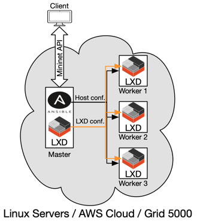
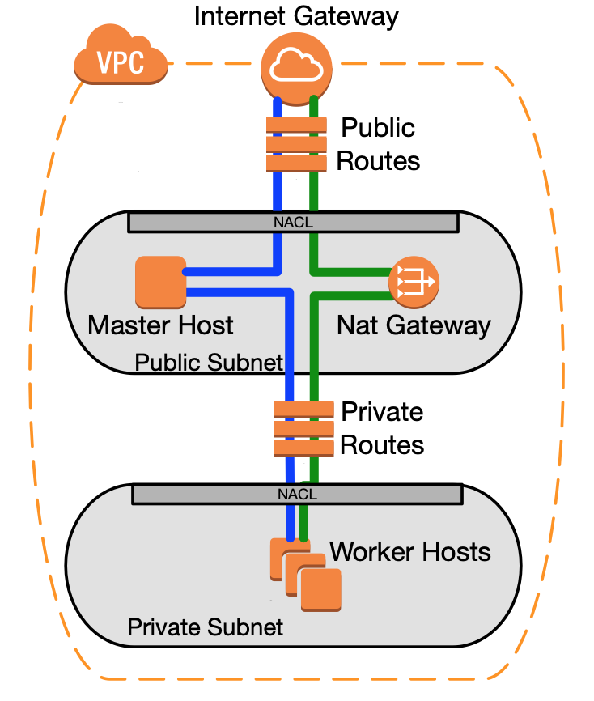
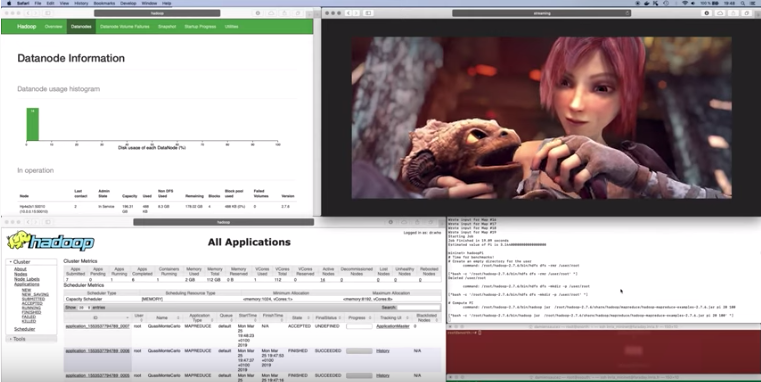

# Overview of Distrinet
{: .fs-9 .no_toc }

Distrinet is a *distributed network emulator* that provides a way to distribute [Mininet](http://mininet.org/) over multiple hosts. It can deploy experiments on **Linux clusters** (e.g., Grid'5000), as well as on the **Amazon EC2** cloud platform.   
Distrinet uses the same API than Mininet, meaning that it is fully compatible with Mininet programs.

{: .fs-6 .fw-300 }

[Get started now](/tutorial.md){: .btn .btn-primary .fs-5 .mb-4 .mb-md-0 .mr-2 } [View it on GitHub](https://github.com/Giuseppe1992/Distrinet){: .btn .fs-5 .mb-4 .mb-md-0 }

## Table of contents
{: .no_toc .text-delta }

1. TOC
{:toc}

# Main Purpose

Despite it is built with lightweight virtual environment techniques, Mininet cannot properly handle resource-intensive experiments because it runs on a single computer ([Mininet limitations](https://github.com/mininet/mininet/wiki/Introduction-to-Mininet#limits)). As such, when heavy load is requested, it is not possible to achieve performance fidelity . Distrinet supports resource-intensive experiments by distributing experiments over multiple machines.

# Architecture

Distrinet provides an infrastructure provisioning mechanism that automatically installs and configures **LXD** and **SSH** on each machine to be used during the experiment by the means of **Ansible**.  
Distrinet can be used in a large variety of experimental infrastructures (e.g., a single computer, a pool of Linux machines, the Grid'5000 testbed, or the Amazon EC2 cloud platform). 

## Linux clusters

Distrinet is composed of three elements, a *client node* executing the experiment script, a *master node* managing the experimental infrastructure, and *slave nodes* running the actual experiment.

    

To run an experiment, Distrinet first decides which machines of the infrastructure will be used for the experiment.
Once the subset of machine is determined, one of the machines is used to be the Ansible master. Ansible is installed on this
master node via SSH from the client machine. Ansible is used to install, deploy, and configure LXD on all the nodes to be used for the experiments by the means of idempotent Ansible playbooks. The machines form an LXD cluster where the host used as Ansible master is the bootstrap LXD node.    
Once the LXD cluster is properly deployed, the container images that will be used for the experiment are imported in LXD. Images
are automatically retrieved from the client machine images directory.  
Links are modeled as virtual networks and the interfaces of the containers involved are connected through VXLAN tunnels. VXLAN is an encapsulation technique to virtualize L2 networks that provides isolation and efficient broadcast when it is deployed in multicast mode

## Amazon EC2

If the experimental infrastructure is Amazon EC2, Mininet Cloud Edition instantiates first a Virtual Private Cloud (VPC) in which the virtual instances running the experiment will be deployed.
A NAT gateway is automatically created to provide Internet access to the emulated nodes. 
Access to the emulated nodes from the experimenter machine is ensured by a master node acting as an SSH relay. 
The deployment on Amazon EC2 only requires an active Amazon AWS account.  

    

Distrinet determines the number of machines to use for an experiment and how to deploy the emulated network on these machines by first solving an optimization problem. 
When no optimization is provided, the placement is decided by the LXC scheduler.  

We provide a demo of Distrinet where we run a compute-intensive experiment composed of Map-Reduce and video streaming workload on the 4-Fat-Tree topology deployed on a cluster of 12 Linux machines.

    

#Other demos
https://www.youtube.com/playlist?list=PLjv6t3T3klL7B6aYsu0y3QKXPwTpVm1S7

# Publications

* G. Di Lena, A. Tomassilli, D. Saucez, F. Giroire, T. Turletti, and C. Lac: [Mininet on steroids: exploiting the cloud for Mininet performance](). 2019 IEEE 8th International Conference on Cloud Networking (CloudNet)

# Contributing

When contributing to this repository, please first discuss the change you wish to make via issue,
email, or any other method with the owners of this repository before making a change. Read more about becoming a contributor in [our GitHub repo](https://github.com/Giuseppe1992/Distrinet/tree/master/CONTRIBUTING.rst).

# Acknowledgments

Inspiration from [Maxinet](https://maxinet.github.io) and [Containernet](https://containernet.github.io) projects
