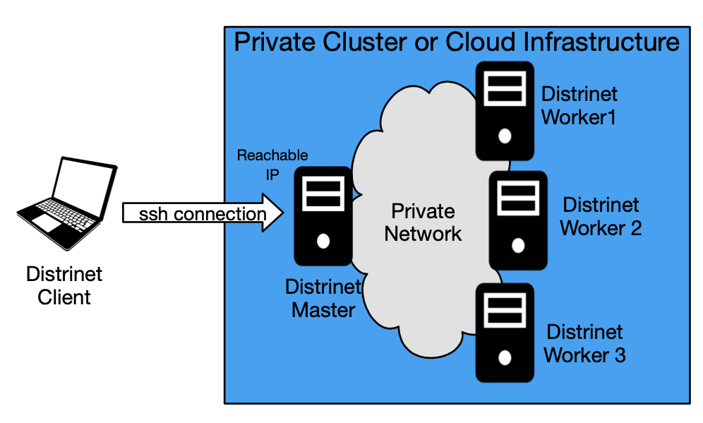

# Installation

You can install Distrinet directly on your machine or you can use Docker (mandatory if you use Windows).

IMPORTANT: You need to install Distrinet only on your Client machine.

This is a typical Distrinet scenario:



## Installation on a Linux machine
### Prerequisites
Make sure to have git, python3 and pip installed.
If not, you can run:
```
sudo apt update && sudo apt install -y git python3-minimal python3-pip
```
### Installation
Move into your home directory, and clone Distrinet repository:
```
cd ~
git clone https://github.com/Giuseppe1992/Distrinet.git
```
Move inside the directory with:
```
cd ~/Distrinet
```
Start the installation by running:
 
```
pip3 install -r requirements.txt
sudo python3 setup.py install
```

Update PYTHONPATH with:
```
export PYTHONPATH=$PYTHONPATH:mininet:
```

### Check the configuration directory
You should have a new folder (.distrinet) in your home directory.

If you are not the root user, add the permission to access this folder, e.g.:
```
ubuntu@client: sudo chmod -R 777 ~/.distrinet
```

Check that the folder exists:
```
cd ~/.distrinet/
ls -al

ubuntu@client:~/.distrinet$ cd ~/.distrinet/
ubuntu@client:~/.distrinet$ ls -al
total 20
drwxrwxrwx 2 root   root   4096 Feb  6 10:45 .
drwxr-xr-x 8 ubuntu ubuntu 4096 Feb  6 10:45 ..
-rwxrwxrwx 1 root   root   1144 Feb  6 10:45 conf.yml
-rwxrwxrwx 1 root   root    426 Feb  6 09:54 general_purpose.json
-rwxrwxrwx 1 root   root   1375 Feb  6 09:54 gros_partial.json
ubuntu@client:~/.distrinet$
```

Note that we will modify the conf.yml file later.

## Installation via Docker
### Prerequisites
Make sure to have git and Docker installed in your machine. If not, go to https://docs.docker.com, and follow the instructions. 

Install git with:
```
sudo apt update && sudo apt install -y git
```
### Installation
Move into your home directory, and clone Distrinet repository.
```
cd ~
git clone https://github.com/Giuseppe1992/Distrinet.git
```
Move inside the directory with:
```
cd ~/Distrinet
```
The container can be built with:
```
docker build -t distrinet:1.1 .
```
The creation can take a couple of minutes. Check that the image is correctly created with:
```
docker image ls
```
If the image "distrinet:1.1" is present, everything is fine. Now the container can be created with:
```
docker container run -it --name distrinet distrinet:1.1
```
Check that it is correctly installed, e.g. with:
```bash
giuseppe@MacBook-Pro-di-Giuseppe Distrinet % docker container run -it --name distrinet distrinet:1.1
root@30363028511c:/Distrinet# cd ~/.distrinet/
root@30363028511c:~/.distrinet# ls -al
total 20
drwxr-xr-x 2 root root 4096 Feb  5 12:52 .
drwx------ 1 root root 4096 Feb  5 12:52 ..
-rw-r--r-- 1 root root  856 Feb  5 12:52 conf.yml
-rw-r--r-- 1 root root  426 Feb  5 12:52 general_purpose.json
-rw-r--r-- 1 root root 1375 Feb  5 12:52 gros_partial.json
root@30363028511c:~/.distrinet# 

```


